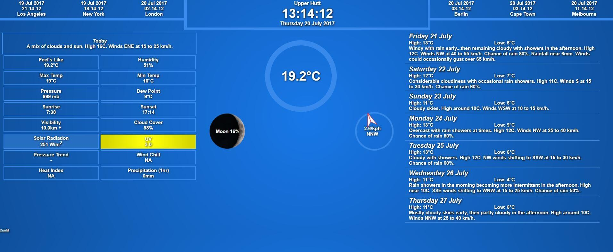

Simple Weather Dashboard for my city.  
Contains current weather, 7-day forecast and 6 other cities' current time.  
Utilizes the WeatherUnderground API (with PHP) and MomentJS for the time functions.  
  
Note: The dashboard currently isn't responsive display and will look ugly on mobile :)  
  
To use the dashboard you need to create your own [WeatherUnderground account](https://www.wunderground.com) and get a Cumulus Plan API key.  
Save the API Key to a file named key.php inside the directory/folder next to the other files.
  

